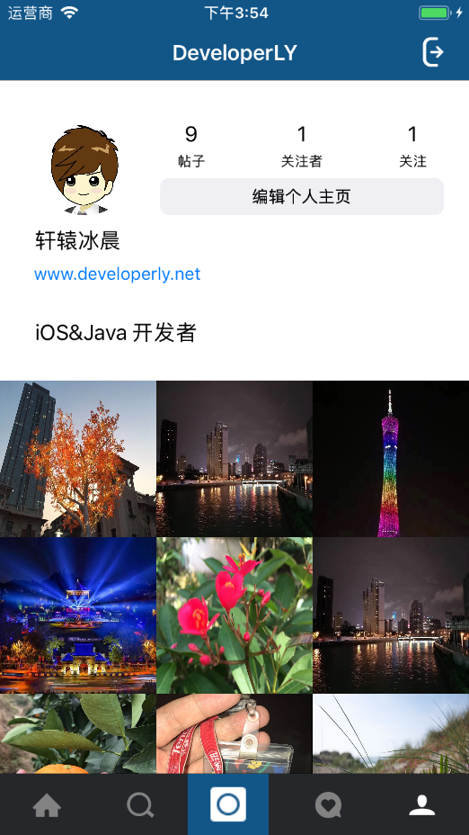

# Instagram-Swift

* `Swift4` 写的类似`Instagram`的一款图片发布社交`App`,模块包括了聚合、搜索、发布、通知、个人几个模块。帖子发布实现了`Hashtags`和`Mentions`功能。功能比较齐全，完全是用`Swift`开发的一个完整的商业应用！

* 后台：使用的是`BAAS`服务做后端，这里使用的是`Leancloud`。

# Screenshot

## 聚合

## 搜索

## 发布

## 通知

## 我的

## GIF效果图
